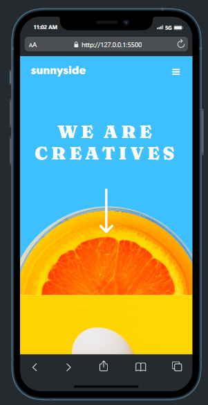

# Frontend Mentor - Sunnyside agency landing page solution

This is a solution to the [Sunnyside agency landing page challenge on Frontend Mentor](https://www.frontendmentor.io/challenges/sunnyside-agency-landing-page-7yVs3B6ef). Frontend Mentor challenges help you improve your coding skills by building realistic projects.

## Table of contents

- [Overview](#overview)
  - [The challenge](#the-challenge)
  - [Screenshot](#screenshot)
  - [Links](#links)
- [My process](#my-process)
  - [Built with](#built-with)
  - [What I learned](#what-i-learned)
  - [Continued development](#continued-development)
  - [Useful resources](#useful-resources)
- [Author](#author)

## Overview

### The challenge

Users should be able to:

- View the optimal layout for the site depending on their device's screen size
- See hover states for all interactive elements on the page

### Screenshot



### Links

- Solution URL: [https://github.com/TrickPatMK/agency-landing-page](https://github.com/TrickPatMK/agency-landing-page)
- Live Site URL: [https://trickpatmk.github.io/agency-landing-page/](https://trickpatmk.github.io/agency-landing-page/)

## My process

### Built with

- Semantic HTML5 markup
- SASS
- Flexbox
- CSS Grid
- Mobile-first workflow
- Vanilla JS

### What I learned

- I learned much about how to using grid for responsive layout
- I learned how to make a triangle

```scss
@mixin triangle($color, $size, $direction) {
  width: 0;
  height: 0;
  @if $direction == "up" {
    border-right: ($size + px) solid transparent;
    border-left: ($size + px) solid transparent;
    border-bottom: ($size + px) solid $color;
  }
  @if $direction == "down" {
    border-right: ($size + px) solid transparent;
    border-left: ($size + px) solid transparent;
    border-top: ($size + px) solid $color;
  }
  @if $direction == "right" {
    border-top: ($size + px) solid transparent;
    border-bottom: ($size + px) solid transparent;
    border-left: ($size + px) solid $color;
  }
  @if $direction == "left" {
    border-top: ($size + px) solid transparent;
    border-bottom: ($size + px) solid transparent;
    border-right: ($size + px) solid $color;
  }
}
```

_referenced from [CSS Chatbox](https://csshint.com/html-css-chat-box-designs/)_

### Continued development

This project make me realize to more deeply learn about clean code and keep getting used to the grid.

### Useful resources

- [How to use grid](https://css-tricks.com/look-ma-no-media-queries-responsive-layouts-using-css-grid/) - This helped me for the grid layout
- [CSS wildcard](https://www.geeksforgeeks.org/wildcard-selectors-and-in-css-for-classes/) - This helped me for the advanced way to styling
- [CSS Chatbox](https://csshint.com/html-css-chat-box-designs/) - This helped me for make the triangle. It make me inspired. Alot.

## Author

- Frontend Mentor - [@TrickPatMK](https://www.frontendmentor.io/profile/TrickPatMK)
- Twitter - [@PatrickMartK](https://www.twitter.com/PatrickMartK)
